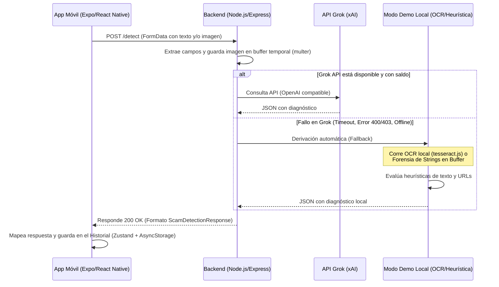

# Guía de Estudio y Defensa: PhishGuard 🛡️

Esta guía ha sido diseñada para prepararte a ti y a tus compañeros para la evaluación de mañana. Contiene el resumen técnico del proyecto, cómo se cumplen los puntos de la pauta, las respuestas clave ante la comisión evaluadora y una **explicación sumamente detallada del código fuente**.

---

## 📋 Ficha Técnica del Proyecto

*   **Nombre del Proyecto:** PhishGuard
*   **Propósito:** Aplicación móvil de ciberseguridad para detectar intentos de fraude (phishing y estafas) analizando tanto mensajes de texto sospechosos como capturas de pantalla de chats o comprobantes de pago.
*   **Arquitectura:**
    *   **Frontend (Cliente):** Aplicación móvil construida con **React Native** usando **Expo** (TypeScript).
    *   **Backend (Servidor):** Microservicio web en **Node.js** con **Express** (TypeScript).
    *   **Motor de IA:** API de **Grok (xAI)** compatible con el SDK de OpenAI, con un mecanismo de contingencia automático (**Modo Demo**) que corre de forma 100% local en Node.js.

---

## 🎯 Cumplimiento de la Pauta de Evaluación

### 1. Las Tres Funcionalidades Principales
1.  **Análisis de Mensajes de Texto:** El usuario ingresa un texto copiado (como un SMS sospechoso). El sistema detecta patrones de phishing (urgencia, amenazas, marcas, enlaces sospechosos).
2.  **Análisis Visual de Capturas de Pantalla:** El usuario sube o toma una foto de un chat. El backend extrae el texto mediante **OCR** y analiza logotipos sospechosos.
3.  **Historial Persistente de Diagnósticos:** Los análisis realizados se guardan en el celular del usuario para que pueda consultarlos después sin necesidad de re-analizar.

### 2. Navegación y Diseño Básico
*   La aplicación tiene 3 pantallas claras distribuidas usando `@react-navigation/native-stack`:
    *   `HomeScreen` (Ingreso de texto y selección de imagen)
    *   `AnalysisResultScreen` (Desglose del diagnóstico, medidor de urgencia, URLs detectadas, justificación)
    *   `HistoryScreen` (Lista de análisis del historial)
*   Se cuidó la jerarquía visual mediante tarjetas con bordes redondeados, colores de alerta (Verde para Seguro, Naranja para Sospechoso, Rojo para Crítico) e íconos intuitivos.

### 3. Estilos y Fuentes Tipográficas
*   El proyecto cumple la regla de tener un estilo definido cargando dinámicamente **dos familias de fuentes** de Google Fonts mediante el hook `useFonts` de Expo:
    1.  `Montserrat-Bold`: Utilizada para títulos principales y encabezados debido a su peso visual y apariencia moderna.
    2.  `Inter-Regular`: Utilizada para textos descriptivos, justificaciones y datos técnicos por su excelente legibilidad en pantallas pequeñas.

### 4. Persistencia Local
*   Se utiliza **Zustand** (un gestor de estado rápido y moderno para React) acoplado a `@react-native-async-storage/async-storage` mediante el middleware `persist`.
*   Esto serializa el historial de análisis del usuario en formato **JSON** y lo almacena de forma no volátil en el almacenamiento físico del dispositivo celular.

---

## 🛠️ Flujo de Datos (Arquitectura de la App)



---

## 🧠 Preguntas Dirigidas del Examen (Simulación)

### Pregunta 1: ¿Cómo implementaron la persistencia local en la aplicación?
*   **Respuesta Estudiante:** *"Usamos **Zustand** como manejador de estado global. Para cumplir con la persistencia, conectamos Zustand con **AsyncStorage** usando el middleware `persist`. Esto guarda automáticamente el historial de análisis en formato **JSON** en el almacenamiento interno persistente del celular, lo que significa que el historial se mantiene incluso si el usuario cierra o apaga la aplicación."*
*   **Archivo Clave:** [store.ts](file:///c:/Users/pepin/OneDrive/Desktop/moviles/PhishGuard/store.ts)

### Pregunta 2: ¿Cómo funciona el mecanismo de "Modo Demo" o Fallback? ¿Qué pasa si el servidor de Grok está caído o no tienen saldo/internet?
*   **Respuesta Estudiante:** *"Implementamos un patrón de diseño de **contingencia automática (Fallback)**. En el backend, las peticiones HTTP que enviamos a la API de Grok están envueltas en un bloque `try/catch`. Si la llamada a la IA de Grok falla debido a falta de internet, problemas de red o cuotas de API, capturamos el error en el catch y redirigimos la consulta instantáneamente al **Modo Demo** local (`demoModeService`), garantizando que la aplicación nunca se caiga y devuelva un análisis heurístico confiable al instante."*
*   **Archivo Clave:** [grokService.ts](file:///c:/Users/pepin/OneDrive/Desktop/moviles/PhishGuard/scam-detector-service/src/services/grokService.ts)

### Pregunta 3: En el "Modo Demo", ¿cómo analizan una imagen localmente sin conectarse a la IA?
*   **Respuesta Estudiante:** *"Utilizamos un sistema de dos etapas. Primero, intentamos realizar un **OCR** (Reconocimiento Óptico de Caracteres) local usando la librería `tesseract.js` (que compila a WebAssembly y corre nativa en Node.js) para extraer cualquier texto escrito en la imagen. Si el OCR falla o el servidor está totalmente sin internet (impidiendo inicializar el worker), ejecutamos un **fallback forense secundario** que escanea el buffer de bytes binarios de la imagen extrayendo cadenas ASCII imprimibles (similar al comando `strings` de Linux) en busca de palabras de urgencia o enlaces. Finalmente, aplicamos nuestro motor de reglas de texto sobre la cadena resultante."*
*   **Archivo Clave:** [demoModeService.ts](file:///c:/Users/pepin/OneDrive/Desktop/moviles/PhishGuard/scam-detector-service/src/services/demoModeService.ts)

### Pregunta 4: ¿Qué criterios heurísticos utiliza el Modo Demo para decidir si un texto o enlace es phishing?
*   **Respuesta Estudiante:** *"El motor local analiza 4 capas:*
    1.  *Gatillos de Urgencia: Palabras clave en español como 'urgente', 'bloqueada', 'suspensión', 'actualiza ya'.*
    2.  *Datos Sensibles: Solicitudes de información como 'contraseña', 'CVV', 'clave', 'pin'.*
    3.  *Impersonación: Búsqueda de nombres de marcas conocidas como 'BBVA', 'Netflix', 'PayPal' emparejados con palabras de urgencia.*
    4.  *Estructura de Enlaces (URLs): Escaneamos con expresiones regulares para detectar direcciones IP directas (ej. `192.168...`), acortadores de enlaces (como `bit.ly`), TLDs de alto riesgo (como `.xyz`, `.ru`, `.cc`) o dominios typosquatted como `netflix-update-portal.cc`.*
    *Calculamos un puntaje de riesgo sumando los pesos de cada indicador y si supera el 40% (0.40) se declara como fraude."*

---

## 📂 Explicación Detallada del Código (Paso a Paso)

A continuación se describe detalladamente la lógica, la arquitectura y el propósito de cada archivo importante en el proyecto.

### 1. El Controlador de Peticiones: [scamController.ts](file:///c:/Users/pepin/OneDrive/Desktop/moviles/PhishGuard/scam-detector-service/src/controllers/scamController.ts)
*   **Propósito:** Es el punto de entrada de la petición HTTP del celular. Procesa los parámetros de entrada y decide a qué métodos de análisis llamar.
*   **Lógica clave:**
    ```typescript
    export const detectScam = async (req: Request, res: Response) => {
      try {
        const { text } = req.body; // Extrae el campo de texto de la petición
        const file = req.file;      // Extrae la imagen binaria subida (si existe)

        // Validación: Al menos uno de los dos debe estar presente
        if (!text && !file) {
          return res.status(400).json({ error: 'Neither text nor image provided' });
        }

        let analysis;
        // Caso A: Análisis mixto (Texto + Imagen)
        if (text && file) {
          analysis = await analyzeCombinedScam(text, file.buffer, file.mimetype);
        } 
        // Caso B: Solo Imagen
        else if (file) {
          analysis = await analyzeImageScam(file.buffer, file.mimetype);
        } 
        // Caso C: Solo Texto
        else if (text) {
          analysis = await analyzeTextScam(text);
        }

        return res.status(200).json(analysis); // Devuelve la respuesta en JSON
      } catch (error: any) { ... }
    };
    ```

---

### 2. El Integrador de la IA: [grokService.ts](file:///c:/Users/pepin/OneDrive/Desktop/moviles/PhishGuard/scam-detector-service/src/services/grokService.ts)
*   **Propósito:** Conectar el backend con la API de Grok (xAI) y manejar de forma segura los errores redirigiendo al Modo Demo.
*   **Lógica clave:**
    *   **Inicialización:** Instancia el SDK de `OpenAI` apuntando a `https://api.x.ai/v1`. Como la API de xAI es compatible con la especificación de OpenAI, se puede usar el mismo cliente oficial de NPM `openai`.
    *   **Prompts de Sistema:** Se define un rol estricto para la IA: *"ACTÚA COMO UN INVESTIGADOR FORENSE DE CIBERCRIMEN DE ÉLITE"*, aplicando la metodología de "Zero Trust" (Confianza Cero).
    *   **Mecanismo de Contingencia (Fallback):**
        ```typescript
        export const analyzeTextScam = async (text: string): Promise<ScamDetectionResponse> => {
          if (!openai) { // Si no hay API Key, pasa directo a Modo Demo
            return demoModeService.analyzeTextScam(text);
          }

          try {
            // Intenta consumir la API de Grok con formato estructurado JSON
            const response = await openai.chat.completions.create({
              model: ENV.GROK_MODEL, // Por defecto 'grok-beta'
              messages: [ ... ],
              response_format: { type: 'json_object' } // Fuerza respuesta en JSON puro
            });
            return JSON.parse(response.choices[0].message.content) as ScamDetectionResponse;
          } catch (error: any) {
            // Si la conexión falla, se captura el error y se ejecuta el Modo Demo
            console.warn('[Grok Service] Falling back to local Demo Mode...');
            return demoModeService.analyzeTextScam(text);
          }
        };
        ```


---

### 3. El Motor Local: [demoModeService.ts](file:///c:/Users/pepin/OneDrive/Desktop/moviles/PhishGuard/scam-detector-service/src/services/demoModeService.ts)
*   **Propósito:** Analizar texto y procesar imágenes 100% localmente utilizando heurísticas de ciberseguridad y OCR.
*   **Lógica clave:**
    *   **`analyzeTextScamInternal`:** Analiza el texto en 4 capas de sospecha:
        1.  **Urgencia:** Busca términos como "cuenta suspendida", "actualiza ya", "bloqueada". Cada coincidencia suma `0.20` al score (máximo `0.50`).
        2.  **Credenciales:** Busca palabras como "contraseña", "cvv", "código", "datos de pago". Cada coincidencia suma `0.15` (máximo `0.40`).
        3.  **Marcas famosas (Impersonation):** Si se menciona una marca (Netflix, Amazon, BBVA) en un contexto de urgencia o con enlaces, el score incrementa un `0.35` de golpe.
        4.  **URLs y Expresiones Regulares:**
            *   Usa la expresión regular `/(?:https?:\/\/)?(?:[a-zA-Z0-9-]+\.)+[a-zA-Z]{2,}(?:\/[^\s]*)?/gi` para capturar cualquier enlace (con o sin protocolo, ej: `netflix-update-portal.cc`).
            *   Si el dominio usa una IP directa (ej: `192.168.1.99`), suma `0.50` de sospecha.
            *   Si usa acortadores (`bit.ly`), suma `0.25`.
            *   Si usa TLDs sospechosos (`.xyz`, `.ru`, `.cc`), suma `0.35`.
            *   Si incluye el nombre de una marca pero no en su dominio oficial (ej: `amazon-rewards.xyz`), se marca como secuestro de marca sumando `0.40`.
    *   **OCR local con Tesseract:**
        ```typescript
        try {
          // Inicializa Tesseract en español e inglés y lee la imagen desde memoria
          const ocrResult = await Tesseract.recognize(imageBuffer, 'spa+eng');
          text = ocrResult.data.text; // Guarda el texto reconocido
        } catch (error) {
          // Si el sistema está offline y no puede descargar los archivos de Tesseract,
          // ejecuta una inspección binaria buscando strings ASCII legibles en el buffer.
          text = extractAsciiStrings(imageBuffer);
        }
        ```
    *   **Búsqueda Forense en el Búfer (`extractAsciiStrings`):** Recorre el búfer byte a byte e identifica secuencias de más de 5 caracteres que se encuentren dentro del rango ASCII imprimible (32 a 126), descartando ruido de compresión no legible.

---

### 4. La Persistencia en la App Móvil: [store.ts](file:///c:/Users/pepin/OneDrive/Desktop/moviles/PhishGuard/store.ts)
*   **Propósito:** Gestionar el estado global de la aplicación y la base de datos local del historial del usuario.
*   **Lógica clave:**
    *   Define la estructura de un registro en el historial (`AnalysisRecord`):
        ```typescript
        interface AnalysisRecord {
          id: string;      // ID único generado con la fecha/timestamp
          date: string;    // Fecha formateada del análisis
          message: string; // El texto escaneado
          image: string | null; // URI de la imagen si se usó una
          riskLevel: string;    // "Bajo", "Medio", "Crítico" o "Error"
          score: number;        // Puntaje de sospecha (0 a 100)
        }
        ```
    *   Crea el almacén reactivo usando la librería `Zustand`:
        ```typescript
        export const useStore = create<MessageState>()(
          persist(
            (set) => ({
              message: '',
              setMessage: (message) => set({ message }),
              image: null,
              setImage: (image) => set({ image }),
              history: [], // El arreglo con todos los análisis anteriores
              addAnalysisToHistory: (record) =>
                set((state) => ({ history: [record, ...state.history] })), // Inserta al inicio
              clearHistory: () => set({ history: [] }), // Limpia el historial
            }),
            {
              name: 'phishguard-storage', // Clave del JSON guardado en el storage
              storage: createJSONStorage(() => AsyncStorage), // Define AsyncStorage como el motor
            }
          )
        );
        ```
*   **Detalle para la defensa:** `Zustand` actúa como gestor de estado (reemplazando a Redux que es muy pesado y verboso). Al acoplarlo con `persist` y `AsyncStorage`, se automatiza todo el proceso de serialización a JSON y des-serialización en el celular de manera transparente.

---

### 5. Adaptador de Datos Frontend: [analyzer.js](file:///c:/Users/pepin/OneDrive/Desktop/moviles/PhishGuard/utils/analyzer.js)
*   **Propósito:** Mapear y procesar la respuesta cruda del backend para transformarla en la interfaz de usuario bonita (medidores de riesgo, hallazgos clasificados, etc.).
*   **Lógica clave:**
    *   **`mapBackendToFrontend`:** Toma la respuesta en formato `ScamDetectionResponse` y calcula los valores para las vistas:
        ```javascript
        const score = Math.round(confidenceScore * 100);
        let riskLevel = 'Bajo';
        if (score >= 75) riskLevel = 'Crítico';
        else if (score >= 40) riskLevel = 'Medio';
        ```
    *   Filtra los patrones detectados utilizando expresiones regulares para separar el tag de la descripción:
        ```javascript
        const findings = detectedPatterns.map(p => {
          // Busca el patrón "[TAG] Detalle"
          const match = p.match(/^\[([^\]]+)\]\s*(.*)$/);
          if (match) {
            return { category: match[1], evidence: match[2] };
          }
          return { category: 'General', evidence: p };
        });
        ```
    *   Determina booleanos rápidos si se detectó urgencia, URLs o solicitudes de contraseñas buscando las etiquetas correspondientes en los patrones devueltos.

---

resiliencia de software.
3.  **Hacer Énfasis en la Tipografía:** Comenten al profesor que cargaron `Montserrat-Bold` e `Inter-Regular` de forma dinámica para garantizar que los textos de phishing se visualicen con tipografías legibles y atractivas.
